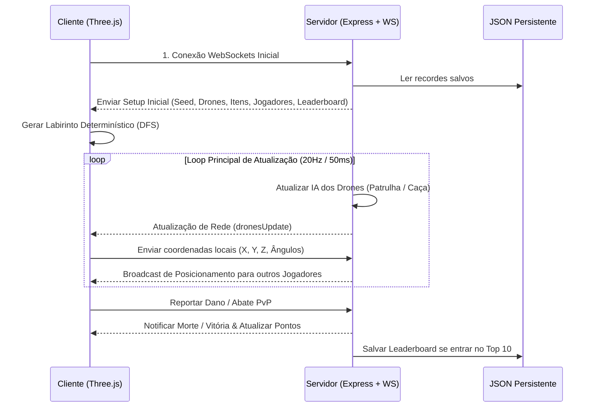

# 🎮 SCAPE RUNNER | Sobrevivência Voxel FPS Multiplayer

<p align="center">
  
  
  
  
  
</p>

---

## 🌌 Visão Geral

**Scape Runner** é um shooter de sobrevivência em primeira pessoa (FPS) multiplayer com estética **Retro-Cyberpunk e Voxel 3D**. Desenvolvido em **JavaScript Puro (Vanilla)** e alimentado por **Three.js** para renderização gráfica e **WebSockets** para rede, o jogo coloca múltiplos sobreviventes dentro de um complexo de labirintos gerados de forma procedural e repletos de perigos artificiais.

A premissa é simples, rápida e implacável: **Corra ou morra. Cada um por si.** A única salvação é alcançar o **Portal Dourado de Fuga**, mas a rota está protegida por drones sentinelas altamente equipados com lasers letais, além de outros jogadores dispostos a eliminar concorrentes para garantir a liderança e subir na tabela global de classificação.

---

## ✨ Recursos de Destaque

> [!NOTE]
> Todos os recursos visuais e sonoros do jogo são **gerados dinamicamente via código**, proporcionando um carregamento ultrarrápido sem dependência de assets ou pacotes pesados.

### 🌐 1. Multiplayer Síncrono e Reativo
- **Conectividade em Tempo Real**: Sincronização ultra-estável de posição de jogadores (coordenadas X, Y, Z), ângulos de câmera (*yaw* e *pitch*), animação de braços, projéteis e estados de saúde/armadura.
- **Combate Híbrido**: Lute contra inteligências artificiais sentinelas ou traia seus companheiros de fuga. Abates de drones rendem `+600` pontos e eliminações PvP rendem `+1000` pontos.
- **Comunicação por Chat**: Canal tático integrado na parte inferior esquerda com cores correspondentes aos trajes sensoriais escolhidos pelos jogadores.

### 🧩 2. Labirinto e Biomas Procedurais
- **Algoritmo DFS Determinístico**: O servidor distribui uma semente (*seed*) numérica para os clientes na inicialização da sala. O jogo reconstrói o mapa de forma 100% idêntica no cliente através de um gerador DFS determinístico.
- **Divisão em Setores**: O labirinto é composto por **3 Biomas** distintos e zonas de transição industriais (*Bunkers*):
  - ❄️ **Setor 1 (Gelo)**: Blocos gelados acinzentados com coberturas de neve e piso escorregadio.
  - 🌲 **Setor 2 (Ardenas - Floresta)**: Paredes de pedra cobertas de musgo e folhagem com solo de grama vibrante.
  - 🏜️ **Setor 3 (Deserto)**: Estruturas de arenito dourado com marcas de vento e areia movediça.
  - 🏢 **Bunkers de Transição**: Divisórias de metal industrial com rebites e piso de concreto antiderrapante com padrão xadrez.

### 🎨 3. Estética Visual de Ponta
- **Filtro CRT Clássico**: Filtro de Scanlines de tubo retro e efeito vinheta suave atenuado nas bordas para uma imersão arcade perfeita.
- **Modelagem Voxel em Três Dimensões**: Personagens representados como corredores com trajes de astronautas retro com visores brilhantes e membros que balançam dinamicamente ao caminhar.
- **Retrato DOOM-like Animado**: O HUD dinâmico central possui um retrato do seu corredor renderizado em tempo de execução 2D. Ele move os olhos seguindo sua câmera e expressa dor ao receber tiros ou repouso ao coletar cura.

### 🔊 4. Sintetizador de Som Procedural
- **Sem Arquivos MP3/WAV**: Utiliza a **Web Audio API** do próprio navegador para sintetizar ondas sonoras retro no instante em que ocorrem:
  - 🪨 *Disparo de Atiradeira*: Ruído branco modulado por filtro passa-banda combinado com onda dente de serra descendente.
  - 🔔 *Impacto Metálico (Dano no Drone)*: Chime senoidal curto com alta frequência.
  - 🩸 *Dano Recebido*: Slide descendente grave dente de serra com passa-baixas para simular impacto pesado.
  - 🧪 *Coleta de Suprimentos*: Arpejo melódico rápido de ondas triangulares (440Hz -> 660Hz).

---

## 🛠️ Arquitetura Técnica

O **Scape Runner** segue um padrão cliente-servidor robusto de baixa latência escrito inteiramente em Node.js com WebSockets estruturados nativamente.

### Fluxo de Comunicação reativa



---

## 📂 Estrutura de Arquivos

```
📂 scape-runner
├── 📂 public/                   # Client-side (Frontend)
│   ├── index.html              # Estrutura do HUD, CRT Overlays e Páginas de Menu
│   ├── style.css               # Estilo visual avançado, paleta Cyberpunk, Glassmorphism
│   ├── game.js                 # Laço de animação Three.js, controle de câmera FPS e rede WS
│   ├── maze.js                 # Gerador determinístico de labirinto (DFS) e mapeador de Biomas
│   ├── sound.js                # Sintetizador de efeitos sonoros procedural (Web Audio API)
│   └── textures.js             # Gerador de texturas pixel art determinísticas (Canvas 2D)
├── server.js                   # Server-side (Backend - IA de Drones, Colisão, Sockets)
├── highscores.json             # Armazenamento persistente de recordes Top 10
├── Dockerfile                  # Empacotamento de container preparado para Cloud Run
├── package.json                # Configurações do projeto e dependências
└── README.md                   # Este manual do projeto
```

---

## ⌨️ Guia de Controlos Táticos

| Tecla | Ação Realizada |
| :---: | --- |
| <kbd>W</kbd> <kbd>A</kbd> <kbd>S</kbd> <kbd>D</kbd> / <kbd>Setas</kbd> | Mover o sobrevivente pelo labirinto |
| <kbd>Mouse</kbd> | Controlar a mira e direção do olhar |
| <kbd>Clique Esquerdo</kbd> | Esticar e soltar a atiradeira elástica para disparar pedras |
| <kbd>Enter</kbd> | Abrir o chat de conversação / Enviar mensagem |
| <kbd>ESC</kbd> | Pausar a partida e liberar cursor do mouse |

---

## 🚀 Como Executar o Projeto

Você pode iniciar o Scape Runner localmente em poucos passos ou empacotar em um contêiner Docker.

### Requisitos Prévios
- [Node.js](https://nodejs.org/) v18 ou superior instalado.

### Opção A: Execução Local Básica

1. **Clonar o Repositório**:
   ```bash
   git clone https://github.com/omarcoscardoso/scape-runner.git
   cd scape-runner
   ```

2. **Instalar as Dependências**:
   ```bash
   npm install
   ```

3. **Executar o Servidor de Desenvolvimento**:
   ```bash
   npm run dev
   ```

4. **Jogar**:
   Abra seu navegador e acesse: [http://localhost:3000](http://localhost:3000) (ou a porta exibida no seu console). Para testar o multiplayer, abra abas adicionais ou envie o endereço para dispositivos na mesma rede local!

---

### Opção B: Execução via Docker (Produção)

Este projeto já vem configurado com um `Dockerfile` leve e otimizado com base em Alpine Linux.

1. **Construir a Imagem**:
   ```bash
   docker build -t scape-runner .
   ```

2. **Executar o Contêiner**:
   ```bash
   docker run -d -p 8080:8080 --name scape-runner-app scape-runner
   ```

3. **Jogar**:
   Abra o seu navegador em [http://localhost:8080](http://localhost:8080).

> [!TIP]
> A imagem está pronta e configurada para implantação rápida em plataformas de nuvem serverless, como **Google Cloud Run** ou **Render**, as quais injetam a variável de ambiente `PORT` dinamicamente.

---

## 🏆 Regras e Lógica da Pontuação

Para conquistar as posições mais prestigiadas na tabela do **Top 10 Sobreviventes**, você precisa agir de forma agressiva e ágil:

- **Duração do Score**: Todos os jogadores começam a partida com **10.000 pontos**. O placar decai constantemente conforme o tempo passa, incentivando rotas mais rápidas.
- **Recompensas de Combate**:
  - 🤖 **Destruição de Sentinela**: `+600 pontos` adicionados na pontuação.
  - 🩸 **Eliminação de Oponente**: `+1000 pontos` roubados do alvo abalroado.
- **Suprimentos de Respawn**:
  - Kits de saúde vermelhos curam `40%` de sua integridade.
  - Caixas de munição amarelas devolvem `5` pedras para sua atiradeira.
  - Ambos os itens reaparecem de forma automática a cada **15 segundos** nos mesmos pontos de geração.
- **Condição de Vitória**: Chegar ao Portal Dourado no final do Setor 3 resgata o jogador, congela sua pontuação atual, salva seu tempo de velocidade na máquina e aciona um reinício síncrono da sala inteira com um mapa totalmente novo em **10 segundos**.

---

## 📜 Licença

Este projeto é de código aberto e está licenciado sob os termos da licença [MIT](). Sinta-se livre para clonar, modificar e expandir seu próprio complexo de sobrevivência voxel!

---
<p align="center">
  Desenvolvido com 💙 por <b>Antigravity</b> e a comunidade gamer voxel.
</p>
